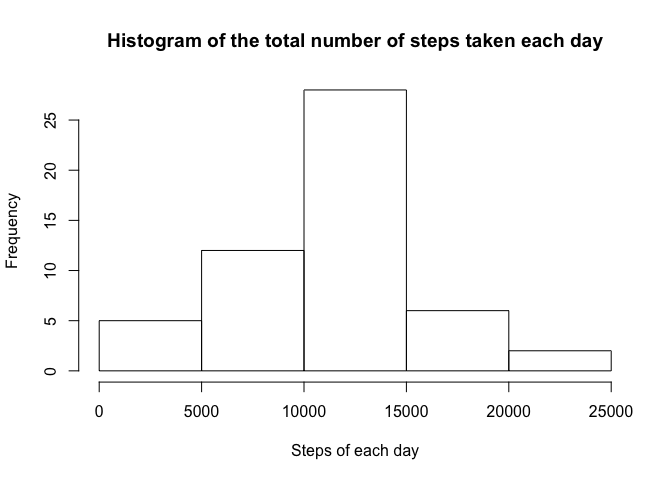
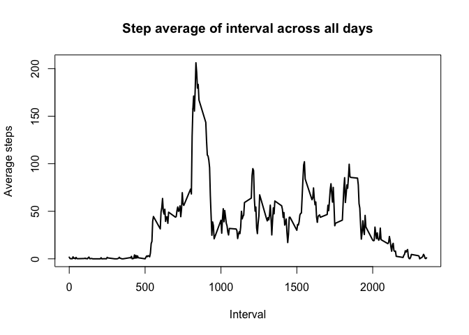
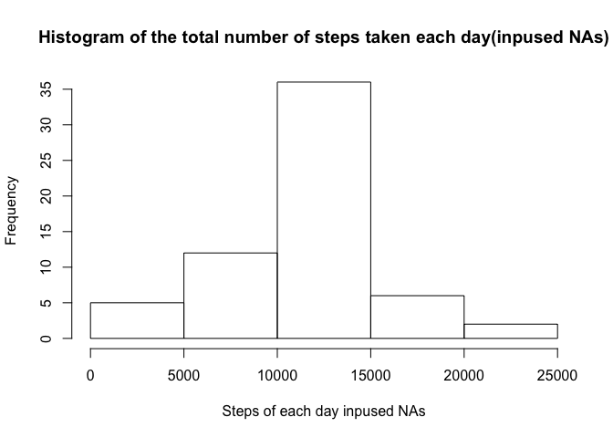
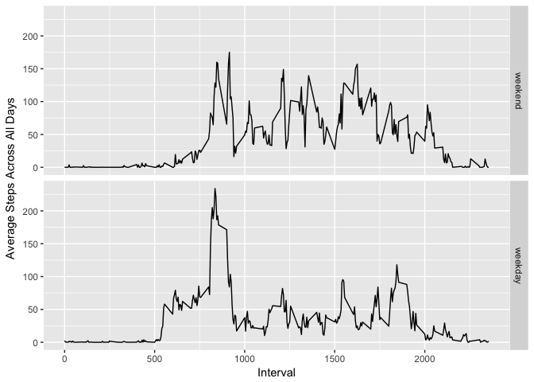

# Reproducible Research: Peer Assessment 1


## Loading and preprocessing the data

```r
library(ggplot2)
activity <- read.csv("activity.csv")
```

## What is mean total number of steps taken per day?

```r
totalSteps <- aggregate(activity$steps, by = list(activity$date), FUN = sum)
hist(totalSteps$x, xlab = "Steps of each day", main = "Histogram of the total number of steps taken each day")
```

<!-- -->


## What is the average daily activity pattern?

```r
averageOfInterval <- aggregate(activity$steps, by = list(activity$interval), FUN = mean, na.rm = TRUE)
plot(averageOfInterval$Group.1, averageOfInterval$x, xlab = "Interval", ylab = "Average steps", 
     main = "Step average of interval across all days", type = 'l', lwd = 2)
```

<!-- -->

```r
maxInterval <- averageOfInterval$Group.1[which.max(averageOfInterval$x)]
print(paste0("5-minute interval contains the maximum number of steps is: ", maxInterval))
```

```
## [1] "5-minute interval contains the maximum number of steps is: 835"
```


## Imputing missing values

```r
numNa <- sum(is.na(activity$steps))
print(paste0("Total number of NAs is: ", numNa))
```

```
## [1] "Total number of NAs is: 2304"
```

```r
df1 <- activity
#inpuse the NA with average step of interval across all days
for(i in 1:nrow(df1)){
    if(is.na(df1$steps[i])){
        df1$steps[i] <- round(averageOfInterval[averageOfInterval$Group.1 ==  df1$interval[i], 2])
    }
}
totalStepsNa <- aggregate(df1$steps, by = list(df1$date), FUN = sum)
hist(totalStepsNa$x, xlab = "Steps of each day inpused NAs", main = "Histogram of the total number of steps taken each day(inpused NAs)")
```

<!-- -->

```r
print(paste0("Mean with and without NA is: ", mean(totalSteps$x, na.rm = TRUE),"  ", mean(totalStepsNa$x)))
```

```
## [1] "Mean with and without NA is: 10766.1886792453  10765.6393442623"
```

```r
print(paste0("Mean with and without NA is: ", median(totalSteps$x, na.rm = TRUE),"  ", median(totalStepsNa$x)))
```

```
## [1] "Mean with and without NA is: 10765  10762"
```


## Are there differences in activity patterns between weekdays and weekends?

```r
wDay <- weekdays(as.Date(activity$date))
weekDay <-c('Monday', 'Tuesday', 'Wednesday', 'Thursday', 'Friday')
activity$wDay <- factor(wDay %in% weekDay, levels = c(FALSE, TRUE), labels = c("weekend", "weekday"))
averageOfIntervalWDay <- aggregate(activity$steps, by = list(activity$interval, activity$wDay), FUN = mean, na.rm = TRUE)
p <- ggplot(averageOfIntervalWDay, aes(Group.1, x))
p + geom_line() + facet_grid(Group.2 ~.) + labs(x = "Interval", y = "Average Steps Across All Days")
```

<!-- -->
